<picture>
  <source media="(prefers-color-scheme: dark)" srcset="dark.svg">
  <source media="(prefers-color-scheme: light)" srcset="light.svg">
  
</picture>

B.Tech CSE student, currently building projects at the intersection of **AI/ML and Cybersecurity**, and preparing to pursue an MS/M.Tech abroad in Cybersecurity, Network Security, IoT, or Blockchain.

- 🔐 Interested in: Cybersecurity · Information Security · Network Security · IoT · Blockchain
- 🤖 Also building hands-on with AI/ML — NLP models, LLM-powered apps, practical automation
- 🎓 Applying to graduate programs abroad in Fall intake — open to research and lab connections in the above areas
- 🛠️ Learn by building: I prefer shipping working full-stack projects over just tutorials

---

### 🚀 Featured Project

**[Personalized Networking Assistant](https://github.com/Sereenakudari/Personalized-Networking-Assistant)**
AI-powered web app that generates tailored networking plans and conversation starters for events, with Wikipedia-based fact-checking and feedback-driven history.
`FastAPI` `Streamlit` `Google Gemini API` `DistilBERT` `SQLite` `Pytest`

---

### 🧰 Tech I work with

`Python` `FastAPI` `Streamlit` `Git/GitHub` `Hugging Face Transformers` `SQLite`

---

### 📫 Let's connect
Open to conversations about cybersecurity research, grad school, or collaborating on a project.

<!--
Optional additions once ready:
- LinkedIn badge/link
- Portfolio site link
- GitHub stats card, e.g.:
  
-->
